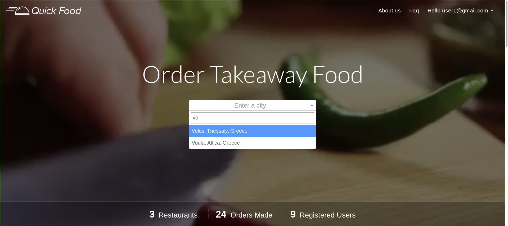
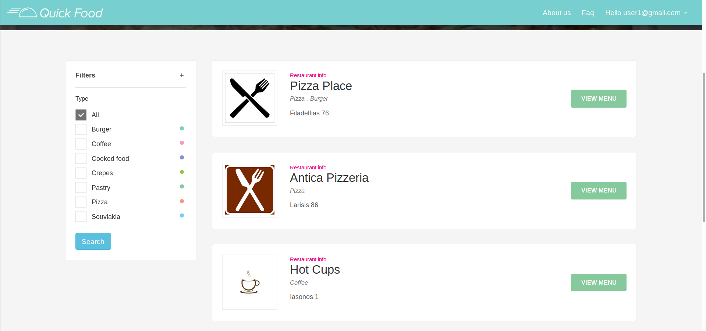
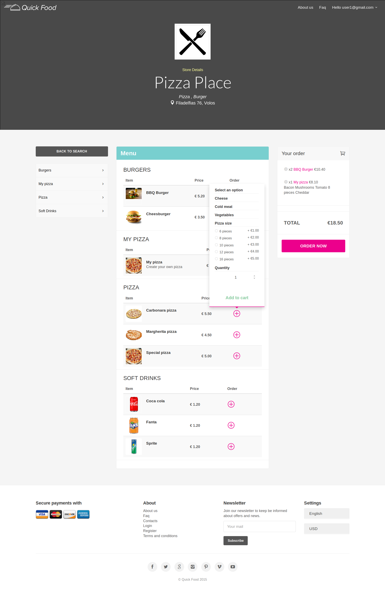
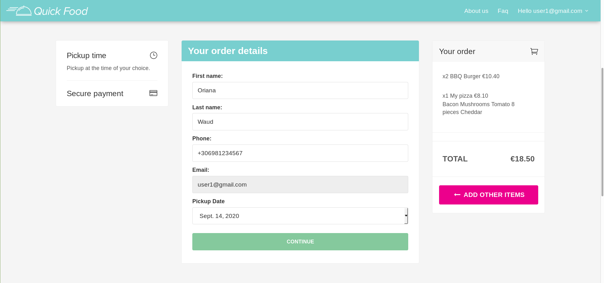
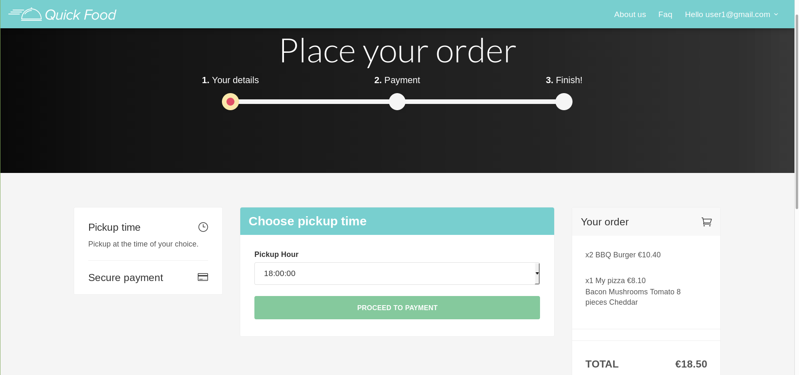
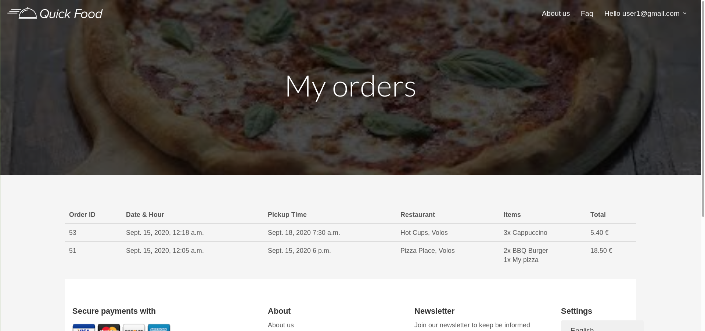
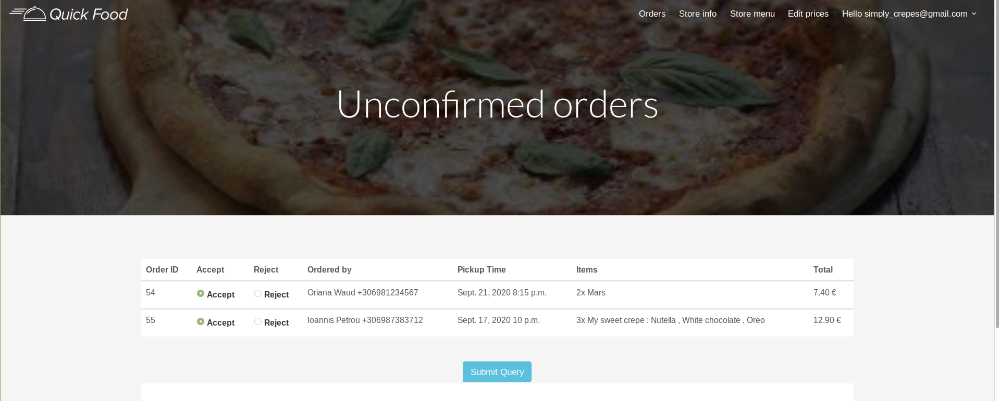
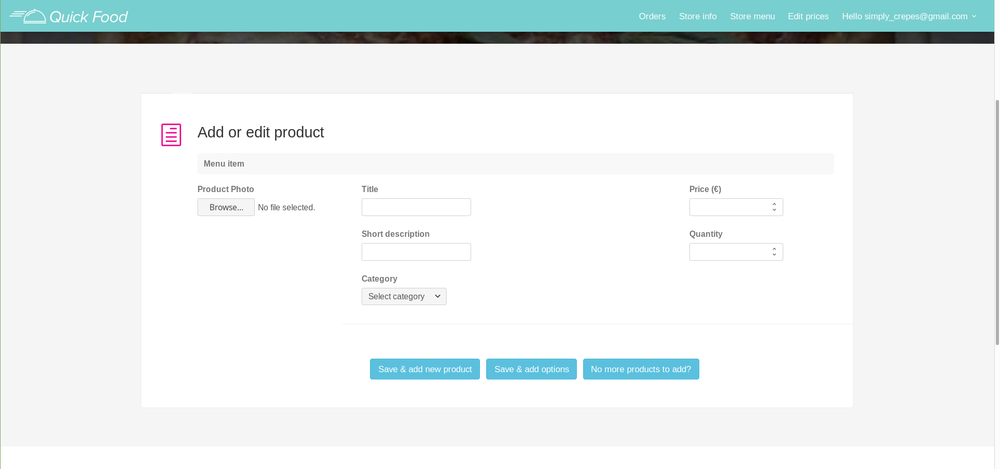

# PeiNow Project - A Web-based System for Ordering Products, using NoSQL Database Technologies
This project was built using Django, MongoDB, HTML, CSS, JS and jQuery. It is a web application used for online food ordering and allows users to select their preferred date and time for picking up their order. 

Users can: 
1. Register to the app and login/logout
2. Update their profile information and password
3. Choose a city and view the restaurants of that city by type (e.g., burger, pizza, pastry, coffee)
4. View restaurant details such as name, type of food served, address and opening times
5. View the menu of each restaurant, add items to cart, update their quantity and remove them
6. Make an order after entering their details (e.g., first name, last name, email, phone) and choose a pickup date and hour.
7. Pay by credit card
8. View their order history

Restaurants can: 
1. Create an account and login/logout
2. Add information about them such as name, description, photo, type of food served, phone, address and opening hours
3. Add new items to their menu, delete products and edit information about them such as product name, description, price, photo, and food category
4. Choose the ingredients that will be available to the users for creating their own coffee, pizza, crepe and burger, and specify their price
5. Get notified as soon as a new order is made and accept/reject it
6. View orders that have already be picked up, will be picked up that day or in the following days

## Screenshots

Homepage

Search for restaurants

Add item to cart

Choose pickup date

Choose pickup time

Order history

Homepage (for restaurants)

Add items to menu (for restaurants)

